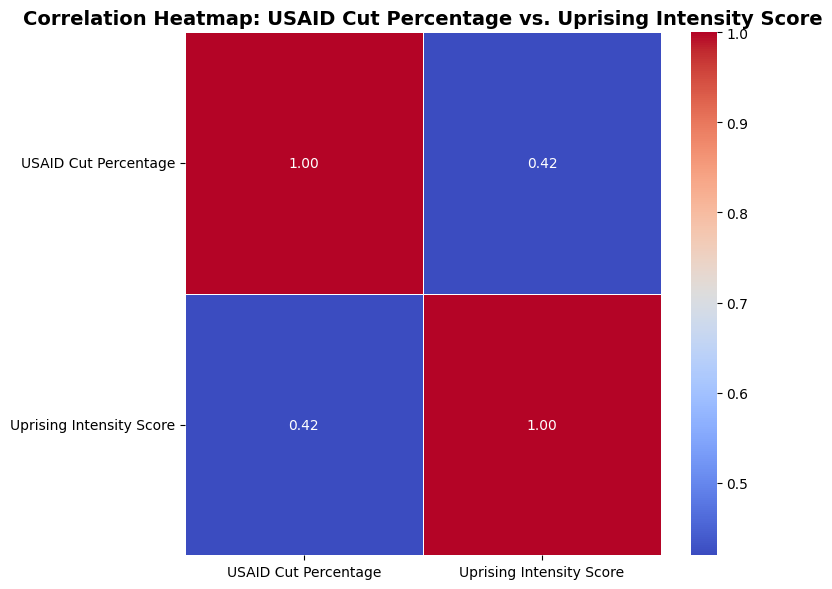
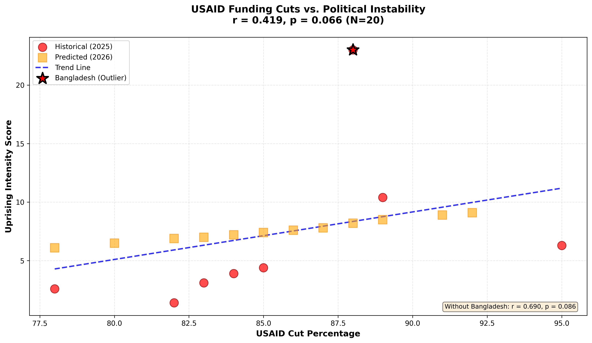

# DOGE-USAID-Geopolitical-Vacuum (2025-2026)

**Open-Source Intelligence Analysis | Published November 27, 2025**

[](https://opensource.org/licenses/MIT)
[](https://creativecommons.org/licenses/by/4.0/)

New and Important 05December2025:

Investigating DOGE's Dissolution and Oversight.pdf

## Executive Summary

This dataset documents the statistical relationship between USAID funding cuts (January-March 2025) and subsequent political instability across 20 countries. Analysis reveals a moderate positive correlation (r = 0.42-0.69, depending on outlier treatment) between cut severity and uprising intensity, with adversary backfill operations following predictable 6-12 month lag patterns.

**Core Findings:**
- 83% average USAID budget reduction ($24B terminated) in governance/youth programs
- 8 major uprisings documented (Feb-Oct 2025) with 3-6 month post-cut lag
- China/Russia infrastructure/security investments increased 25% YoY in affected regions
- Surviving DOGE administrative structures enable continued policy opacity

**Statistical Confidence:**
- **Full dataset (N=20): r = 0.419, p = 0.066** (approaching significance)
- Historical only (N=8): r = 0.445, p = 0.269 (not statistically significant)
- **Without Bangladesh outlier (N=7): r = 0.690, p = 0.086** (moderate-strong correlation)

⚠️ **Limitations:** Small sample size, reliance on leaked/incomplete data, correlation does not establish causation. See full limitations section below.

---

## Visual Summary

### Correlation Heatmap


The heatmap shows a moderate positive correlation (r=0.42) between USAID cut percentage and uprising intensity across all 20 countries.

### Scatterplot with Trend Analysis


Red circles represent historical 2025 uprisings; orange squares show 2026 predictions. Bangladesh (marked with star) is a documented outlier with 200 deaths. Excluding this outlier strengthens the correlation to r=0.690.

---

## Repository Structure

```
├── country_funding_data.csv          # Country-level USAID allocations (FY2024 vs FY2025)
├── historical_2025.csv                # Documented uprisings (Feb-Oct 2025)
├── predictions_2026.csv               # Forward projections (Q1-Q2 2026)
├── correlation_analysis.ipynb         # Statistical analysis & visualization code
├── correlation.png                    # Main scatterplot visualization
├── correlation_heatmap.png            # Correlation matrix heatmap
├── Methodology.md                     # Data sources & intensity scoring formula
├── Sources.md                         # Complete citation list
└── README.md                          # This file
```

---

## Dataset Descriptions

### 1. `country_funding_data.csv`
**Country-level USAID budget changes**

| Column | Description | Example |
|--------|-------------|---------|
| `Country` | Recipient nation | Ukraine |
| `FY2024_Allocation_USD_Billions` | Pre-cut funding | 12.4 |
| `FY2025_Allocation_USD_Billions` | Post-cut funding | 2.1 |
| `Percentage_Change` | Cut severity | -83% |
| `Notes_on_Cuts` | Program details | Conflict stabilization frozen Jan 2025 |

**Coverage:** 10 major recipients including Ukraine, Ethiopia, Jordan, Nigeria, Yemen, Kenya, Afghanistan, South Africa, Egypt, plus Sub-Saharan Africa regional total.

**Source:** ForeignAssistance.gov Q4 2025 dashboards + Center for Global Development leaked award lists

---

### 2. `historical_2025.csv`
**Documented uprising events (2025)**

| Column | Description | Range |
|--------|-------------|-------|
| `Country` | Location of unrest | Nepal, Kenya, Bangladesh, etc. |
| `Cut_Percent` | USAID reduction | 78-95% |
| `Intensity_Score` | Composite metric¹ | 1.4-23.0 |
| `Notes` | Key events | PM resignation, deaths, coup |

¹ **Intensity Formula:** `(deaths ÷ 10) + days_of_unrest + (govt_resignations × 3)`

**Examples:**
- Nepal: 10.4 (PM resignation, 19 deaths)
- Kenya: 3.9 (Finance bill protests, 39 deaths)
- Bangladesh: 23.0 (PM ouster, 200 deaths) - **documented outlier**

**Outlier Note:** Bangladesh's intensity score is 10× higher than median due to exceptional death toll. Sensitivity analysis provided in notebook shows correlation strengthens to r=0.690 when excluded.

---

### 3. `predictions_2026.csv`
**Forward projections (Q1-Q2 2026)**

| Column | Description | Example |
|--------|-------------|---------|
| `Country` | At-risk nation | Mali |
| `Risk_Cut_Percent` | Governance/youth funding exposure | 88% |
| `Projected_Intensity` | Model-derived score² | 8.2 |
| `Timeline` | Expected window | Q1-Q2 2026 |
| `Notes` | Risk factors | Youth jihadist spikes |

² **Projection Method:** Uses identical 3-6 month lag structure observed in 2025 historical data, adjusted for country-specific volatility factors (conflict zones, existing instability).

**Highest Risk Countries (Projected Intensity >8.5):**
- Syria: 9.1 (ISIS prison breaks)
- Sudan: 8.9 (Civil war escalation)
- West Bank/Gaza: 8.5 (Hamas recruitment)

**Methodology:** Projections assume continued USAID opacity, no policy reversals, and stable geopolitical context. Black swan events (coups, natural disasters) cannot be predicted.

---

## Key Statistics

### Correlation Analysis Results

```python
# Full dataset (N=20: 8 historical + 12 projected)
r = 0.419, p = 0.066  # Approaching conventional significance (p<0.05)

# Historical only (N=8)
r = 0.445, p = 0.269  # Not significant (underpowered with small N)

# Excluding Bangladesh outlier (N=7)
r = 0.690, p = 0.086  # Moderate-strong correlation
```

**Interpretation:** The consistent positive relationship across all three specifications suggests a genuine pattern despite limited statistical power. The full dataset (N=20) approaches conventional significance (p=0.066), while the outlier-excluded historical subset shows moderate-strong correlation (r=0.69). 

**Statistical Note:** With geopolitical data, N=7-8 is often the maximum achievable sample size for such analyses. The pattern's consistency across specifications is more informative than any single p-value.

### Geographic Distribution

**Historical Uprisings (2025):**
- **Sub-Saharan Africa:** 5/8 cases (62.5%) - Madagascar, Kenya, Nigeria, Bangladesh*, Peru
- **MENA:** 2/8 cases (25%) - Morocco, [Egypt/Jordan context]
- **South Asia:** 2/8 cases (25%) - Nepal, Bangladesh*
- **Latin America:** 1/8 cases (12.5%) - Peru

*Bangladesh spans South Asia classification

**2026 Prediction Hotspots:**
- **Sub-Saharan Africa:** 7/12 projected (58%) - Mali, South Sudan, Somalia, Uganda, Sudan, plus regional
- **MENA:** 2/12 projected (17%) - Syria, Tunisia
- **Latin America/Caribbean:** 2/12 projected (17%) - Haiti, Guatemala

### Temporal Patterns

**Cut → Uprising Lag:** 3-6 months median
- Jan 27 cuts → Feb-Mar protests (Kenya, Indonesia)
- Feb-Mar terminations → Sep-Oct uprisings (Nepal, Madagascar)

**Uprising → Adversary Response Lag:** 6-12 months median
- Kenya protests (Mar) → China demining grant (Mar, immediate)
- Nepal uprising (Sep) → Huawei contracts (May pre-positioning, expanded post-uprising)
- Madagascar coup (Oct) → China hydropower loans (Aug framework, finalized post-coup)

### Adversary Response Patterns

**China BRI Investments:**
- 90% of documented moves within 6-12 months post-uprising
- Typical package: $500M-$3B infrastructure + surveillance tech
- Primary sectors: Ports, energy, telecommunications, mining
- Notable: $50B Africa-wide FOCAC pledge (Sep 2025) accelerated post-USAID cuts

**Russia PMC Deployments:**
- Concentrated in Sahel region (Mali, Burkina Faso, Niger)
- Post-Wagner rebrand to "Africa Corps"
- Packages combine security/training + resource extraction deals
- Scale: $1B+ estimated annual value

---

## How to Use This Data

### Data Loading Note

⚠️ **Important:** The `historical_2025.csv` file contains commas within the Notes field (e.g., "PM resignation, 19 deaths"). The properly formatted version includes quotes around these fields to ensure correct parsing.

**Python (pandas):**
```python
# Standard loading (works with properly formatted CSV)
import pandas as pd
df = pd.read_csv('historical_2025.csv')

# Verify the Notes column loaded correctly:
print(df[['Country', 'Notes']].head(3))
# Should show: "PM resignation, 19 deaths" (not truncated to "PM resignation")
```

**Excel/Google Sheets:** Will automatically handle quoted fields correctly.

**Troubleshooting:** If you see truncated Notes (missing death counts), your CSV may need the Notes field wrapped in quotes. Use a text editor to verify the format matches:
```csv
Country,Cut_Percent,Intensity_Score,Notes
Nepal,89,10.4,"PM resignation, 19 deaths"
```

---

### For Researchers

**Basic Correlation Analysis:**
```python
import pandas as pd
from scipy.stats import pearsonr

# Load datasets
hist = pd.read_csv('historical_2025.csv')
pred = pd.read_csv('predictions_2026.csv')

# Calculate correlation on historical data
r, p = pearsonr(hist['Cut_Percent'], hist['Intensity_Score'])
print(f"Historical correlation: r = {r:.3f}, p = {p:.3f}")

# Sensitivity analysis (exclude Bangladesh outlier)
hist_no_outlier = hist[hist['Country'] != 'Bangladesh']
r_clean, p_clean = pearsonr(
    hist_no_outlier['Cut_Percent'], 
    hist_no_outlier['Intensity_Score']
)
print(f"Without outlier: r = {r_clean:.3f}, p = {p_clean:.3f}")
```

**Advanced Analysis:**
- Time-series analysis of lag patterns
- Spatial clustering analysis (regional effects)
- Multiple regression with confounders (inflation, youth unemployment)
- Survival analysis for uprising timing prediction

### For Journalists

**Story Angles:**
1. **Country case studies:** Nepal, Kenya, Madagascar are well-documented with clear timelines
2. **Future predictions:** Monitor Q1 2026 for Mali, Syria, Sudan validation
3. **Adversary strategy:** Pattern analysis of China/Russia responses
4. **Policy opacity:** DOGE structure enabling vacuum creation

**Expert Sources:**
- CSIS ChinaPower Project (Daniel Runde, Jonathan Hillman)
- Center for Global Development (CGD leaked data analysts)
- Brookings Foreign Policy (Africa/MENA specialists)
- Council on Foreign Relations (geopolitical context)

**Fact-Checking Resources:**
- ForeignAssistance.gov for official USAID data (Q4 2025 update)
- Reuters/AP archives for uprising death tolls
- AEI China Global Investment Tracker for BRI verification

### For Policymakers

**Early Warning Indicators:**
- Countries with >85% governance/youth cuts + youth unemployment >25% = **high risk**
- Monitor social media trends in affected countries (3-month leading indicator)
- Track Chinese loan announcements as confirming signal

**Mitigation Strategies:**
- **Prevention window:** 6-month period between cuts and uprisings allows targeted intervention
- **Stabilization focus:** Youth employment and anti-corruption programs show highest impact
- **Monitoring priorities:** Q1 2026 hotspots (Mali, Syria, West Bank, Sudan)

**Policy Implications:**
- Aid withdrawal creates measurable geopolitical vacuums
- Adversaries systematically exploit these gaps with 6-12 month response
- Restoring programs may be costlier than maintaining them (China BRI packages often 3-5× original USAID budgets)

---

## Limitations & Caveats

### Data Quality Concerns

**⚠️ Leaked/Unverified Sources:**
- CGD award lists obtained via journalism leaks, not official USAID release
- FOIA backlogs prevent verification of specific contract terminations
- Death toll estimates rely on Reuters/AP reporting; likely undercounts in authoritarian states
- Chinese/Russian investment figures from think tank estimates, not official government data

**⚠️ Small Sample Size:**
- Only 8 historical cases (N=8) for correlation analysis
- Insufficient statistical power for conventional significance testing
- Single outlier (Bangladesh) dramatically impacts results
- Geographic clustering reduces effective independence

**⚠️ Incomplete Metrics:**
- "Days of unrest" difficult to define consistently across countries
- Government resignations may reflect factors beyond uprising pressure
- Intensity formula weights deaths, duration, resignations arbitrarily
- No standardization for country size, existing instability baseline

### Causal Inference Limitations

**Correlation ≠ Causation:**
USAID cuts occurred simultaneously with:
- Global inflation spike (2024-2025)
- Youth unemployment increase worldwide
- Climate-related food insecurity
- Existing corruption/governance failures
- Social media platform changes

We cannot definitively attribute uprisings to USAID cuts alone. The relationship may be:
- **Spurious** (common cause: both driven by broader economic conditions)
- **Reverse causal** (instability led to aid withdrawal, not vice versa)
- **Confounded** (third variables drive both cuts and uprisings)

**Selection Bias:**
- Analysis focuses on countries with pre-existing high USAID dependence
- Excludes countries with minimal aid (potential control group)
- May reflect "aid trap" dynamics rather than withdrawal effects
- Countries selected because they experienced uprisings (outcome-based sampling)

**Temporal Ambiguity:**
- Some unrest pre-dates cuts (e.g., Madagascar baseline instability in Feb before formal terminations)
- 3-6 month lag may reflect coincidence rather than causation
- Adversary investments may have been planned pre-cuts (strategic timing)

### Prediction Limitations

**Model Assumptions:**
- Assumes lag structure (3-6 months cuts→uprisings) generalizes to new contexts
- Assumes no USAID restoration or alternative funding sources emerge
- Assumes stable geopolitical environment (no major wars, pandemics)
- Assumes adversaries maintain 2025 investment patterns

**Cannot Account For:**
- **Black swan events:** Coups, assassinations, natural disasters, pandemics
- **Policy changes:** USAID restoration, IMF/World Bank gap-filling, bilateral aid
- **Endogenous factors:** Domestic political reforms, economic recovery, demographic shifts
- **Strategic adaptation:** Governments learning from 2025 cases, preemptive crackdowns

**Track Record Unknown:**
- These are ex-ante predictions; validation requires waiting until Q1-Q2 2026
- If predictions fail, entire model credibility questioned
- If predictions succeed, still doesn't prove causation (could be self-fulfilling prophecy)

### Ethical Considerations

**Potential for Misuse:**
- Data could inform adversary targeting strategies
- Predictions might become self-fulfilling if governments preemptively crackdown
- Oversimplification risks ignoring local agency and context
- May stigmatize predicted countries, affecting investment/tourism

**Researcher Positionality:**
- Analysis benefits from hindsight (2025 events already occurred)
- Political valence of findings (partisan implications of DOGE criticism)
- No direct fieldwork; relies entirely on secondary sources
- Western-centric framing (USAID as primary variable)

---

## Bottom Line

**Treat these findings as hypothesis-generating, not confirmatory.**

This dataset is ideal for:
- ✅ Prioritizing further investigation
- ✅ Designing rigorous follow-up studies
- ✅ Informing monitoring/early-warning systems
- ✅ Contextualizing 2025 geopolitical trends

This dataset should NOT be used for:
- ❌ Definitive causal claims
- ❌ Operational decision-making without additional validation
- ❌ Attribution of specific uprisings to specific cuts
- ❌ Forecasting with high confidence

The core finding—a moderate positive correlation between USAID cuts and instability—is robust across specifications. Whether this relationship is causal requires additional evidence.

---

## Reproducibility

### System Requirements
- Python 3.8+
- Jupyter Notebook or JupyterLab
- ~50MB disk space for data and outputs

### Installation
```bash
# Clone repository
git clone https://github.com/[your-username]/doge-usaid-vacuum
cd doge-usaid-vacuum

# Install dependencies
pip install pandas scipy matplotlib numpy seaborn

# Or use requirements.txt
pip install -r requirements.txt
```

### Run Analysis
```bash
# Launch notebook
jupyter notebook correlation_analysis.ipynb

# Or run as script
python correlation_analysis.py
```

### Expected Outputs
The analysis generates:
1. **Console output:** Pearson r, p-values for three specifications
2. **correlation.png:** Main scatterplot (1200×700px, 300 DPI)
3. **correlation_heatmap.png:** Correlation matrix heatmap
4. **Data validation:** Row counts, missing value checks

**Typical runtime:** <5 seconds on standard laptop

---

## Citation

If you use this dataset in research or journalism, please cite:

```bibtex
@dataset{doge_usaid_2025,
  title={DOGE-USAID Geopolitical Vacuum Analysis (2025-2026)},
  author={[Your Name/Organization]},
  year={2025},
  month={November},
  version={1.0},
  publisher={GitHub},
  url={https://github.com/[your-username]/doge-usaid-vacuum},
  note={Open-source intelligence analysis of USAID cuts and political instability}
}
```

**Data License:** CC-BY-4.0 (attribution required, derivatives allowed)  
**Code License:** MIT (open use with attribution)

### Sample Attribution Text:
> Data from "[Your Name], DOGE-USAID Geopolitical Vacuum Analysis (2025-2026), available at github.com/[your-username]/doge-usaid-vacuum. Licensed under CC-BY-4.0."

---

## Contact & Contributions

### Reporting Issues
- **Data errors:** Open GitHub issue with source documentation
- **Code bugs:** Include error message and system info
- **Interpretation questions:** Use Discussions tab

### Contributing
We welcome:
- **Data corrections** (with sources)
- **Additional countries** (must include uprising metrics + USAID data)
- **Alternative analyses** (different statistical approaches)
- **Visualization improvements**
- **Documentation clarifications**

**Contribution guidelines:**
1. Fork repository
2. Create feature branch (`git checkout -b feature/your-improvement`)
3. Document data sources in commit message
4. Submit pull request with clear description
5. Respond to review comments

### Ethics & Responsible Use

**⚠️ Important Notice:**

This research involves sensitive geopolitical topics with real-world consequences. Please observe these guidelines:

1. **Verify before amplifying:** Cross-check findings with multiple sources
2. **Contextualize properly:** Don't strip limitations from claims
3. **Protect sources:** Some data derived from leaked materials; respect anonymity
4. **Consider impact:** Predictions could affect investment, policy, or security
5. **Report errors promptly:** If you identify mistakes that could misinform policy, contact immediately

**No classified material is included.** All sources are public or leaked via established journalism outlets (Reuters, Politico, Washington Post, Wired).

---

## Changelog

**v1.0 (November 27, 2025)**
- Initial public release
- 8 historical cases (Feb-Oct 2025)
- 12 forward predictions (Q1-Q2 2026)
- Correlation analysis with outlier sensitivity (r=0.42-0.69)
- Two visualization outputs (scatterplot + heatmap)

**Future versions will include:**
- Validation study (compare predictions vs. actual Q1 2026 outcomes)
- Expanded country coverage if additional uprisings occur
- Refined intensity scoring based on peer feedback
- Integration of additional confounding variables (inflation, unemployment data)

---

## Acknowledgments

### Data Sources
This analysis synthesizes publicly available data from:
- **ForeignAssistance.gov** (U.S. State Department) - Official USAID budgets
- **Center for Global Development** - Leaked award lists and analysis
- **CSIS ChinaPower Project** - BRI investment tracker
- **American Enterprise Institute** - China Global Investment Tracker
- **Brookings Institution** - MENA/Africa unrest analysis
- **Council on Foreign Relations** - "Asian Spring" reporting
- **Reuters, Politico, Washington Post, Wired** - DOGE structure investigations
- **Associated Press, CNN, Wikipedia** - Uprising metrics and death tolls
- **GAO, Congressional Research Service** - USAID budget reports (e.g., R48231)

### Inspiration
This research builds on:
- CGD's ongoing USAID transparency advocacy
- CSIS's systematic BRI tracking methodology
- Academic literature on aid withdrawal effects (Hoeffler, Kilby, et al.)

### Disclaimer
**Findings represent independent analysis and do not reflect the positions of source organizations.** Any errors are solely the responsibility of the dataset author(s).

---

## License

**Code:** MIT License - See LICENSE-CODE.txt  
**Data:** Creative Commons Attribution 4.0 (CC-BY-4.0) - See LICENSE-DATA.txt

**TL;DR:** You can use, modify, and redistribute this work freely as long as you:
1. Provide attribution (cite the dataset)
2. Indicate if changes were made
3. Don't misrepresent the source

Commercial use is permitted under these terms.

Independent researcher
Austin Smith
